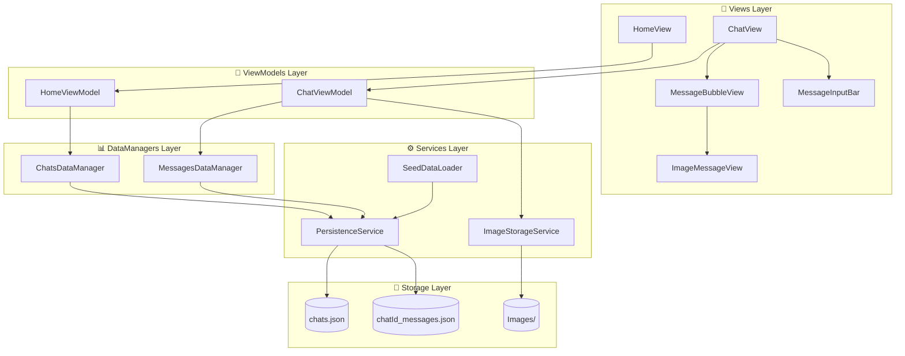
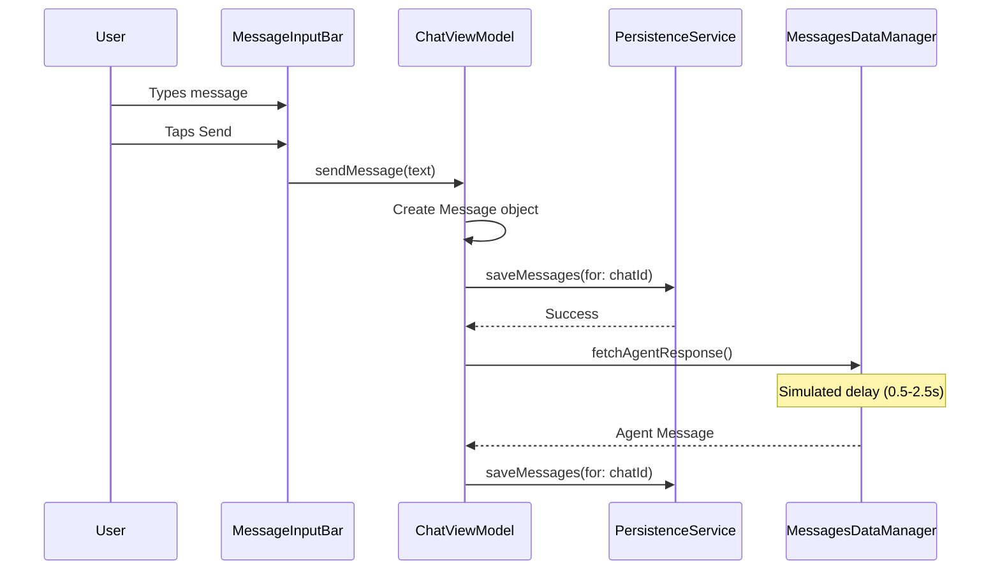
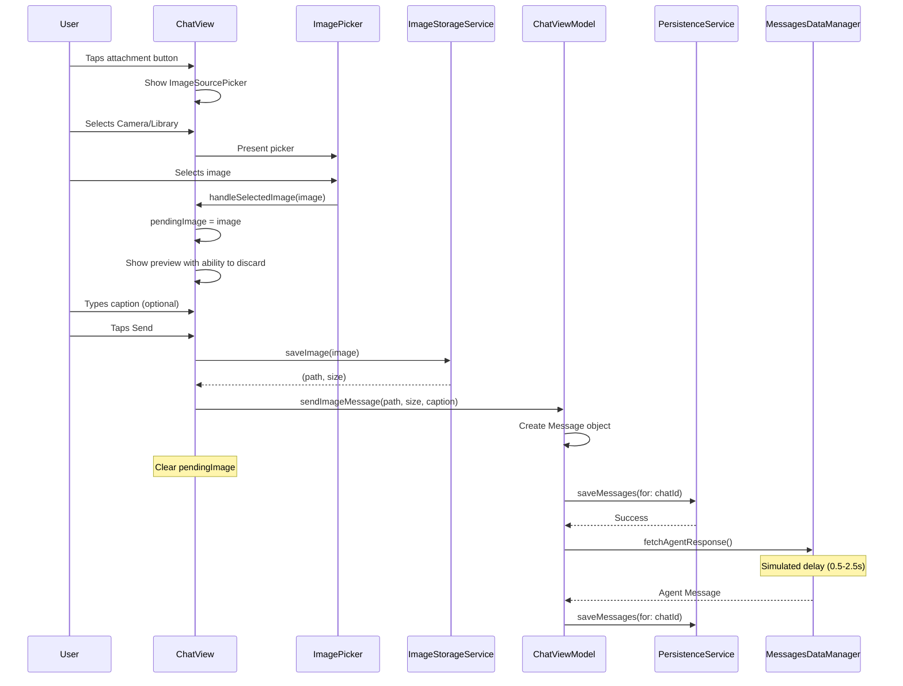
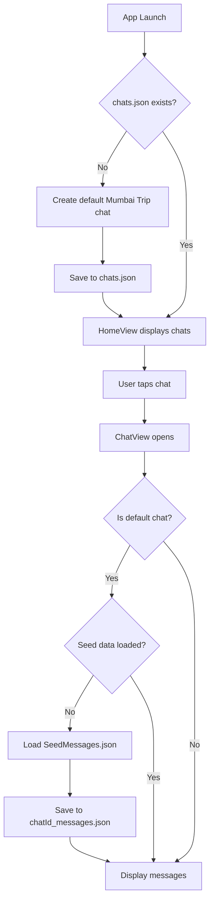

# CrewChat

A SwiftUI-based chat interface app with support for text and image messages, built with MVVM architecture.


> App Walkthrough Videos - https://drive.google.com/drive/folders/1l-ZqwWiFrwYOsPKd40sPfcgD90_j42Vr?usp=sharing

## Setup Instructions

### Requirements

- Xcode 21.0+
- iOS 18.6+
- Swift 5+

### Installation

1. Clone the repository
   ```bash
   git clone https://github.com/yash22arora/crew-message-viewer.git
   ```
2. Open `CrewChat/CrewChat.xcodeproj` in Xcode
3. Select your target device or simulator
4. Build and run (⌘+R)

### First Launch

On first launch, the app creates a default "Mumbai Trip" chat with seed messages demonstrating various message types.

---

## Architecture

### MVVM + DataManager Pattern



### Layer Responsibilities

| Layer            | Responsibility                                                 |
| ---------------- | -------------------------------------------------------------- |
| **Views**        | UI rendering, user interaction, state binding                  |
| **ViewModels**   | Business logic, state management, data transformation          |
| **DataManagers** | Data access abstraction, protocol-based for testability        |
| **Services**     | Low-level I/O operations, file system access, image processing |
| **Storage**      | JSON files for persistence, Images directory for media         |

### Key Design Decisions

| Decision                        | Rationale                                                                            |
| ------------------------------- | ------------------------------------------------------------------------------------ |
| **MVVM Pattern**                | Clean separation between UI and business logic; ViewModels are testable in isolation |
| **Protocol-based DataManagers** | Enables dependency injection and mocking for unit tests                              |
| **Per-chat Message Storage**    | `<chatId>_messages.json` allows independent chat histories and scalability           |
| **@StateObject for ViewModels** | Ensures single initialization when views are recreated by SwiftUI                    |
| **Seed Data from JSON**         | Externalized test data makes it easy to modify without recompiling                   |

### Project Structure

```
CrewChat/
├── 📱 Views/
│   ├── HomeView.swift              # Chat list screen
│   ├── ChatView.swift              # Main chat interface
│   ├── MessageBubbleView.swift     # Message container with context menu
│   ├── TextMessageView.swift       # Text message content
│   ├── ImageMessageView.swift      # Image message with async loading
│   ├── FullScreenImageView.swift   # Zoomable image viewer
│   ├── MessageInputBar.swift       # Text input with send button
│   ├── ImagePicker.swift           # Camera/Library picker wrapper
│   ├── ImageSourcePickerSheet.swift# Bottom sheet for image source
│   └── ImagePreviewBarView.swift   # Preview before sending image
│
├── 🧠 ViewModels/
│   ├── HomeViewModel.swift         # Manages chat list state
│   └── ChatViewModel.swift         # Manages messages and sending
│
├── 📊 DataManager/
│   ├── ChatsDataManager.swift      # Chat CRUD operations
│   └── MessagesDataManager.swift   # Agent response simulation
│
├── ⚙️ Services/
│   ├── PersistenceService.swift    # JSON file I/O for chats & messages
│   ├── SeedDataLoader.swift        # First-launch data seeding
│   └── ImageStorageService.swift   # Image compression & storage
│
├── 📦 Models/
│   ├── Chat.swift                  # Chat model (id, label, createdAt)
│   └── Message.swift               # Message model with FileInfo
│
├── 🛠️ Utilities/
│   ├── Constants.swift             # App-wide constants & keys
│   └── DateFormatters.swift        # Smart timestamp formatting
│
├── 📁 Resources/
│   └── SeedMessages.json           # Default messages for first launch
│
└── CrewChatApp.swift               # App entry point
```

---

## Features

### Core Features

- ✅ Text and image message support
- ✅ Optional Caption for images
- ✅ Image picking from Camera and Photo Library
- ✅ Full-screen zoomable image viewer
- ✅ Chronological message display with smart timestamps
- ✅ Message persistence to local JSON storage
- ✅ Seed data on first launch (for default chat)
- ✅ Keyboard handling with auto-scroll

### Bonus Features

| Feature                           | Description                                                                      |
| --------------------------------- | -------------------------------------------------------------------------------- |
| 🖼️ **Image Preview with Caption** | Preview selected images before sending with optional caption, ability to dismiss |
| 📋 **Long-press Context Menu**    | Native iOS context menu to copy message text                                     |
| ⌨️ **Smart Keyboard Handling**    | Scroll-to-dismiss, tap-to-dismiss, auto-scroll on keyboard show                  |
| 🔄 **Orientation Support**        | Auto-scrolls to bottom on device rotation                                        |
| ⏳ **Typing Indicator**           | Animated bouncing dots while agent is responding                                 |
| 🕐 **Smart Timestamps**           | "Just now", "2 minutes ago", "Today at 3:30 PM", etc.                            |
| 🌐 **External Image URLs**        | Support for both local and remote images via AsyncImage                          |
| 📱 **Multi-chat Architecture**    | Per-chat message storage ready for multiple conversations                        |
| 📳 **Haptic Feedback**            | Tactile feedback on copy action                                                  |
| 🌅 **Image Compression**          | Compressing images before saving with a compression quality of 0.8               |

---

## Data Flow

### Text Message Flow



### Image Message Flow



### App Launch Flow


