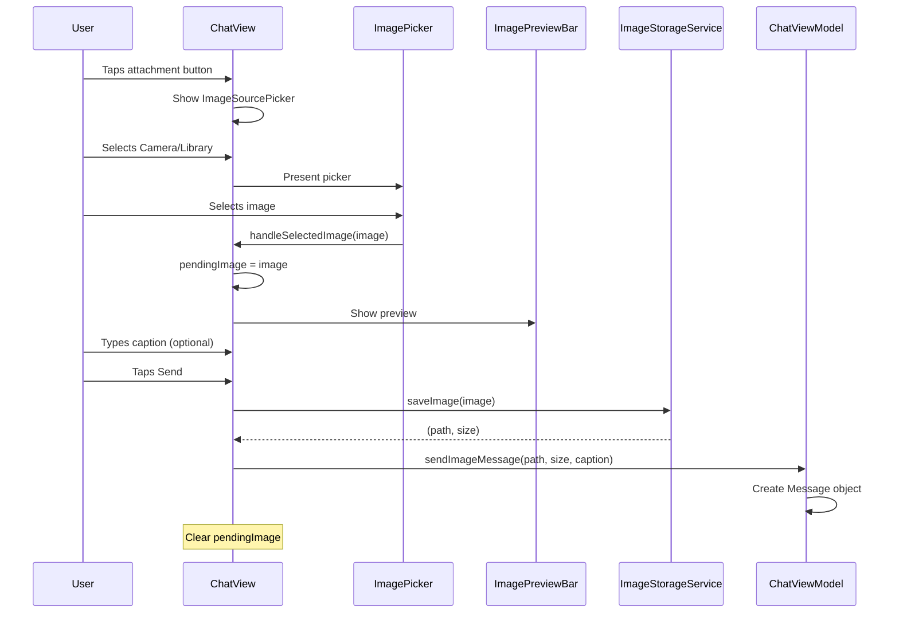

# CrewChat

A SwiftUI-based chat interface app with support for text and image messages, built with MVVM architecture.


## Setup Instructions

### Requirements

- Xcode 21.0+
- iOS 18.6+
- Swift 5+

### Installation

1. Clone the repository
   ```bash
   git clone https://github.com/yash22arora/crew-message-viewer.git
   ```
2. Open `CrewChat/CrewChat.xcodeproj` in Xcode
3. Select your target device or simulator
4. Build and run (⌘+R)

### First Launch

On first launch, the app creates a default "Mumbai Trip" chat with seed messages demonstrating various message types.

---

## Architecture

### MVVM + DataManager Pattern

```
┌─────────────────────────────────────────────────────────────┐
│                         Views                                │
│  HomeView ──────────────────────── ChatView                 │
│      │                                 │                     │
│      ▼                                 ▼                     │
│  HomeViewModel                    ChatViewModel              │
│      │                                 │                     │
│      ▼                                 ▼                     │
│  ChatsDataManager               MessagesDataManager          │
│      │                                 │                     │
│      └────────────┬────────────────────┘                     │
│                   ▼                                          │
│           PersistenceService                                 │
│                   │                                          │
│                   ▼                                          │
│            Local JSON Files                                  │
└─────────────────────────────────────────────────────────────┘
```

### Key Design Decisions

| Decision                        | Rationale                                                                            |
| ------------------------------- | ------------------------------------------------------------------------------------ |
| **MVVM Pattern**                | Clean separation between UI and business logic; ViewModels are testable in isolation |
| **Protocol-based DataManagers** | Enables dependency injection and mocking for unit tests                              |
| **Per-chat Message Storage**    | `<chatId>_messages.json` allows independent chat histories and scalability           |
| **@StateObject for ViewModels** | Ensures single initialization when views are recreated by SwiftUI                    |
| **Seed Data from JSON**         | Externalized test data makes it easy to modify without recompiling                   |

### Project Structure

```
CrewChat/
├── Models/           # Data models (Message, Chat, FileInfo)
├── Views/            # SwiftUI views
├── ViewModels/       # Observable ViewModels
├── Services/         # Persistence, SeedDataLoader, ImageStorage
├── DataManager/      # Data access layer protocols & implementations
├── Utilities/        # Constants, DateFormatters
└── Resources/        # SeedMessages.json, Assets
```

---

## Features

### Core Features

- ✅ Text and image message support
- ✅ Optional Caption for images
- ✅ Image picking from Camera and Photo Library
- ✅ Chronological message display with smart timestamps
- ✅ Message persistence to local JSON storage
- ✅ Seed data on first launch (for default chat)
- ✅ Keyboard handling with auto-scroll

### Bonus Features

| Feature                           | Description                                                                      |
| --------------------------------- | -------------------------------------------------------------------------------- |
| 🖼️ **Image Preview with Caption** | Preview selected images before sending with optional caption, ability to dismiss |
| 📋 **Long-press Context Menu**    | Native iOS context menu to copy message text                                     |
| ⌨️ **Smart Keyboard Handling**    | Scroll-to-dismiss, tap-to-dismiss, auto-scroll on keyboard show                  |
| 🔄 **Orientation Support**        | Auto-scrolls to bottom on device rotation                                        |
| ⏳ **Typing Indicator**           | Animated bouncing dots while agent is responding                                 |
| 🕐 **Smart Timestamps**           | "Just now", "2 minutes ago", "Today at 3:30 PM", etc.                            |
| 🌐 **External Image URLs**        | Support for both local and remote images via AsyncImage                          |
| 📱 **Multi-chat Architecture**    | Per-chat message storage ready for multiple conversations                        |
| 📳 **Haptic Feedback**            | Tactile feedback on copy action                                                  |
| 🌅 **Image Compression**          | Compressing images before saving with a compression quality of 0.8               |

---

## Data Flow

### Text Message Flow


### Image Message Flow



### App Launch Flow


